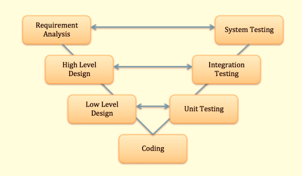

# V-model in Software Testing

V Model is a highly disciplined SDLC model which has a testing phase parallel to each development phase. The V model is an extension of the waterfall model wherein software development and testing is executed in a sequential way. It is also known as the Validation or Verification Model.

## Verification and Validation

### What is Verification

It involves **evaluation a work product, component or system** to determine if it *meets the development requirements* set. Answers the question: "is the deliverable built **according to the specification and standards?**".

### What is Validation

A process concerned with evaluating **a work product, component or system** to determine if it *meets the user requirements and needs*. Answers the question: "does the deliverable **fulfill its purpopse** and provide a solution to the client's problem?"

## Summary

There are numerous development life cycle models. Development model selected for a project depends on the aims and goals of that project.

+ **Testing** is not a stand-alone activity, and it has to adapt the development model chosen for the project.
+ **In any model**, testing should be performed at all levels i.e. right from requirements until maintenance.